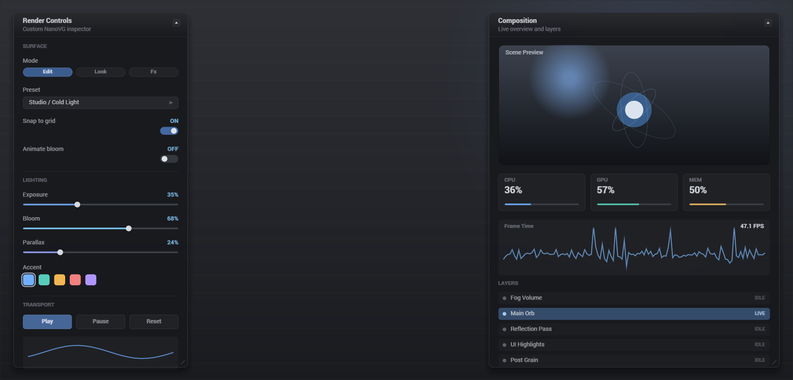
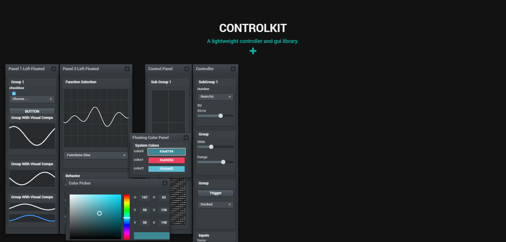
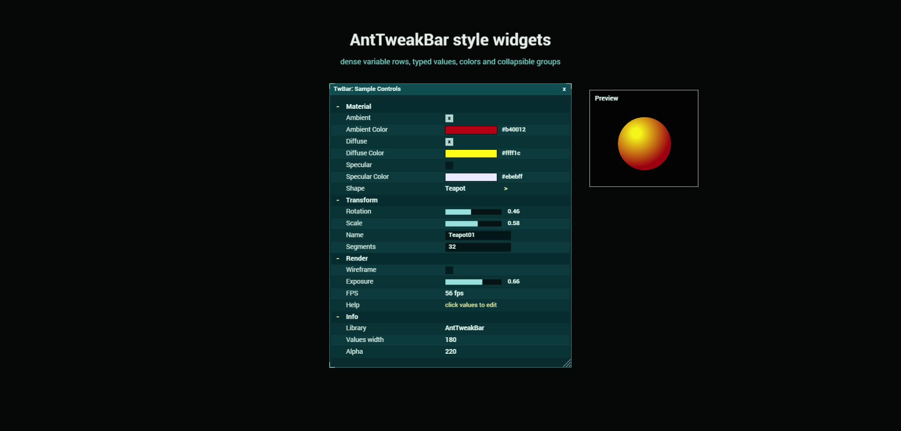
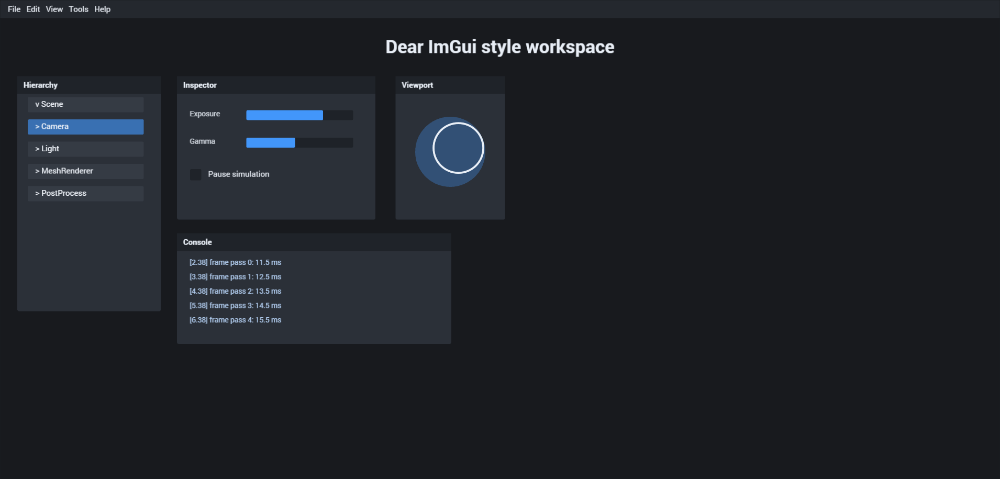
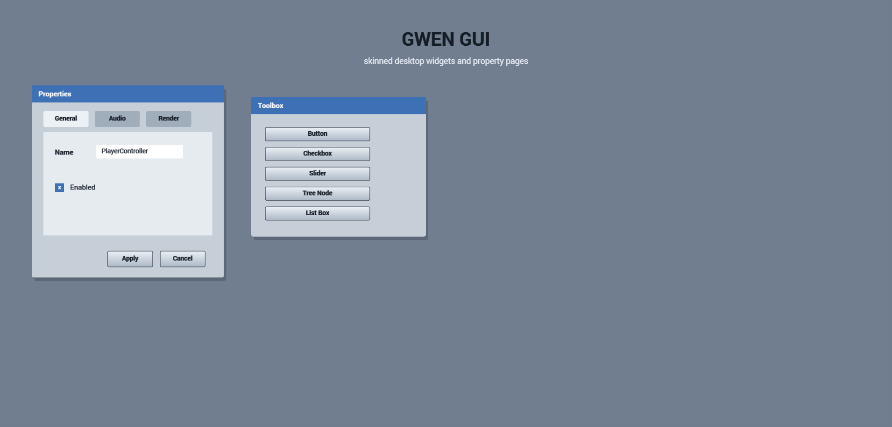

# nanovgjs-gui-demos
GUI demos using nanovgjs, inspired by popular UI libraries and focused on layout and interaction experiments.

## Live demo
`https://1h3a3x7.github.io/nanovgjs-gui-demos/`

## Screenshots
- Neon Console: [Live demo](https://1h3a3x7.github.io/nanovgjs-gui-demos/demos/neon-console/index.html)

- ControlKit: [Live demo](https://1h3a3x7.github.io/nanovgjs-gui-demos/demos/controlkit/index.html)

- AntTweakBar: [Live demo](https://1h3a3x7.github.io/nanovgjs-gui-demos/demos/antweakbar/index.html)

- ImGui (WIP): [Live demo](https://1h3a3x7.github.io/nanovgjs-gui-demos/demos/imgui/index.html)

- GWEN (WIP): [Live demo](https://1h3a3x7.github.io/nanovgjs-gui-demos/demos/gwen/index.html)

## Running locally
- Install dependencies with `npm install`.
- The demos load NanoVG from `node_modules/nanovgjs`.
- Run `npm run dev` and open `http://localhost:5173/`.
